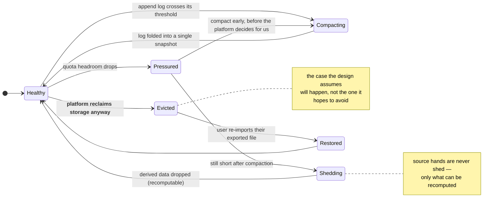
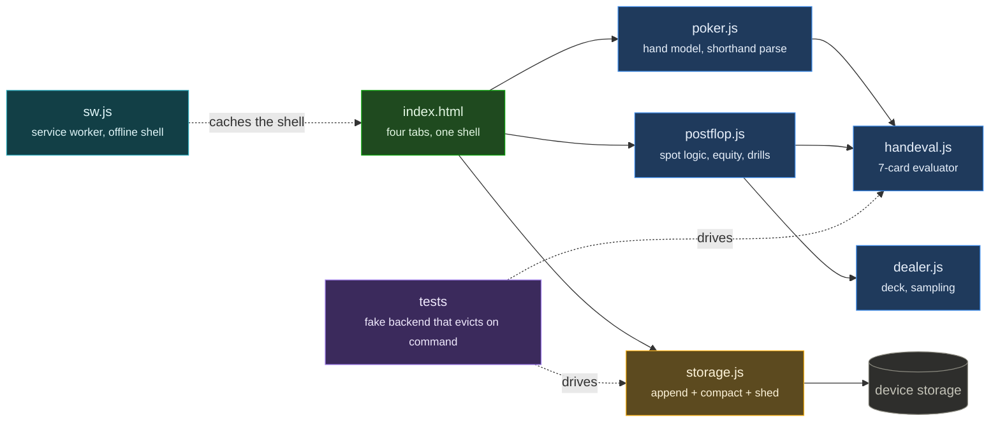

# TableLog

An offline-first poker hand logger and drill trainer. No server, no account, no network
call — the whole product runs in the browser and keeps its data on the device.

_Public overview of a private project (an iOS App Store build). Architecture only._

## The constraint that shaped it

A hand gets logged at the table, on a phone, in the ten seconds before the next deal. That
single requirement rules out most of the usual architecture:

- **No sign-in, no sync, no spinner.** Anything that can be slow at the table gets removed
  rather than optimised.
- **No server at all.** Not a cost decision — a latency and privacy one. There is no
  backend to be down, and no copy of anyone's results anywhere but their own phone.
- **Capture in a shorthand**, not a form. Typing a hand as a short string beats tapping
  through card pickers, and the parser is forgiving about order and spacing.

## Surviving the browser's storage reclamation

The hard engineering problem in a no-server app is that the platform can delete your data.
Mobile Safari evicts site storage under pressure, and a poker log that loses three months
of hands is worse than useless — it silently corrupts the sample you are trying to reason
about.

The storage layer is built for that:

- Writes are **append-structured** with a compacting pass, so a partial write can never
  leave a half-parsed record as the only copy.
- **Quota is treated as an event, not an error** — the app measures headroom, compacts
  early, and degrades by shedding derived data (recomputable) before ever touching source
  hands.
- **Export is a first-class path**, not a settings-screen afterthought: the data leaves as
  a plain file the user owns, and re-imports losslessly.
- Every schema change ships with a **forward migration that is tested against fixtures of
  the previous version**, because a user who upgrades after three months offline must not
  lose the interval.

## The rest of the design

- **Four tabs, fixed.** Log, review, drill, stats. A feature that doesn't fit one of them
  doesn't ship; the tab bar is a contract with the user, not a navigation widget.
- **Drills are generated from the user's own logged hands**, so practice concentrates on
  the spots that actually occur in their game rather than on a generic curriculum.
- **Review is variance-honest.** The statistics refuse to present short-run results as
  skill: a sample too small to distinguish from noise is labelled as such, not rendered as
  a trend line. This is the single most opinionated thing in the product.

## The code

Nine files in [`code/`](code/), copied verbatim — the storage layer, the hand evaluator,
the postflop engine and the tests that drive eviction on demand. See
[`code/README.md`](code/README.md).

## Stack

Vanilla TypeScript and CSS, no framework, no dependencies at runtime. Installable PWA,
wrapped for the App Store. Test suite runs against a headless browser with a fake storage
backend that can be told to evict at any point, which is how the reclamation paths above
are actually exercised.

_Last updated August 2026._
